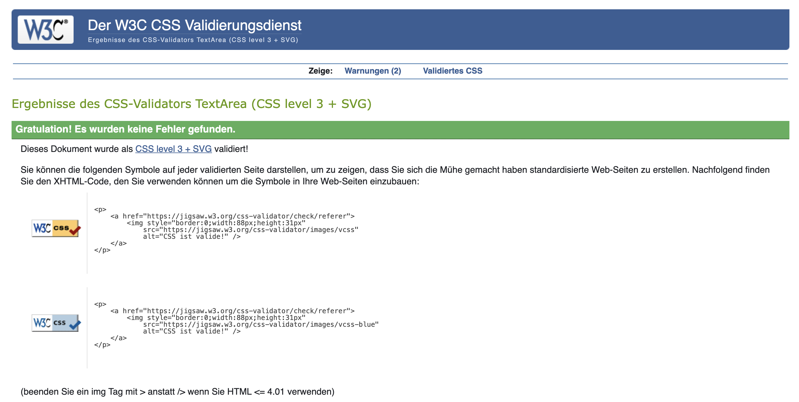

# Fact-Up Science Blog

"" 

[Deployed Link](https://fact-up-science-blog-da75ad178a21.herokuapp.com/)

Fact-Up-Science Blog is a vibrant, approachable science blog dedicated to reigniting the joy and curiosity in science for everyone. Designed to break down barriers and bust stereotypes, it celebrates the lighter, unexpected side of scientific discovery—showcasing how breakthroughs often come from happy accidents, quirky experiments, or just plain fun. The blog invites readers to dive into fascinating science stories, share their own insights, and engage in lively discussions, fostering a welcoming community where being a science nerd is cool and accessible. Whether you want to wow your friends with surprising facts or simply enjoy science as a shared passion, Fact-Up-Science Blog is your friendly gateway to the playful side of science.

# Contents

- [Agile Methodology](#agile-methodology)
  * [Overview](#overview)
  * [MoSCoW Prioritization](#moscow-prioritization)
  * [GitHub Projects](#github-projects)
  * [EPICS](#epics)
  * [User Stories](#user-stories)
- [Website Goals and Objectives](#website-goals-and-objectives)
- [Target Audience](#target-audience)
- [Wireframes](#wireframes)
- [Design Choices](#design-choices)
  * [Typography](#typography)
  * [Colour Scheme](#colour-scheme)
  * [Images](#images)
  * [Responsiveness](#responsiveness)
- [Security Measures and Protective Design](#security-measures-and-protective-design)
  * [User Authentication](#user-authentication)
  * [Password Management](#password-management)
  * [Form Validation](#form-validation)
  * [Database Security](#database-security)
- [Features](#features)
  * [Header/ Navbar](#header-navbar)
  * [Footer](#footer)
  * [Newsletter Subscription](#newsletter-subscription)
  * [About Section](#about-section)
  * [Landing Page](#landing-page)
  * [User Account Page](#user-account-page)
  * [Register Page](#register-page)
  * [Log In Page](#log-in-page)
  * [Log Out Page](#log-out-page)
  * [Comments](#comments)
- [Django Admin Portal](#django-admin-portal)
- [Future Features](#future-features)
    + [Content Interaction](#content-interaction)
    + [Contributor Tools](#contributor-tools)
    + [Community & User Profiles](#community-user-profiles)
    + [Platform Accessibility](#platform-accessibility)
- [Testing](#testing)
    * [HTML](#html)
    * [CSS](#css)   
    * [JavaScript](#javascript)
    * [Python](#python)
    * [Python (Unit Testing)](#python-unit-testing)
  * [User Story Testing](#user-story-testing)
  * [Bugs](#bugs)
  * [Lighthouse Testing](#lighthouse-testing)
  * [Accessibility Testing](#accessibility-testing)
    * [WAVE Testing](#wave-testing)
- [Deployment](#deployment)
  * [Steps to Deploy to Heroku](#steps-to-deploy-to-heroku)
  * [Forking and Cloning the Repository](#forking-and-cloning-the-repository)
- [Testing](#testing)
- [Technology](#technology)
  * [Languages](#languages)
  * [Frameworks & Libraries](#frameworks-&-libraries)
    * [Django Packages](#django-packages)
  * [Design & Development Tools](#design-&-development-tools)
  * [Deployment & Hosting](#deployment-&-hosting)
  * [Version Control](#version-control)
  * [Code Quality & Validation Tools](#code-quality-&-validation-tools)
- [Credits](#credits)
- [Disclaimer](#disclaimer)


## Agile Methodology
### Overview

Agile methodology is a dynamic project management framework focused on adaptability, teamwork, and iterative development toward clearly defined objectives. It’s especially well-suited for software projects, where evolving requirements and solutions emerge through collaboration within self-managed, cross-disciplinary teams. The Agile approach promotes delivering work in small, manageable increments, enhancing both product quality and responsiveness to changing demands.

### MoSCoW Prioritization

The MoSCoW method is a prioritization framework used to rank features and tasks by their significance within a project. It divides items into four categories: Must Have, Should Have, Could Have, and Won’t Have. This classification facilitates efficient allocation of time and resources by ensuring that essential features are addressed first.

### GitHub Projects

GitHub Projects provides a platform for organizing tasks and monitoring progress via project boards. Each board represents an EPIC and is organized into columns that reflect task status such as To Do, In Progress, On Hold, Done, and Bugs.

""  

### EPICS

EPICS (Engineering Projects in Community Service) are large bodies of work that can be broken down into smaller tasks or user stories. Each EPIC represents a significant feature or goal within the project and is tracked on the GitHub Projects board. 

- [EPIC 1: Enable Mailing List Export](https://github.com/Zozo62442/fact-up-science/issues/1)
- [EPIC 2: Content and Feature Development](https://github.com/Zozo62442/fact-up-science/issues/5)
- [EPIC 3: Admin Dashboard & Content Management](https://github.com/Zozo62442/fact-up-science/issues/20)
- [EPIC 4: UX & Performance Optimization](https://github.com/Zozo62442/fact-up-science/issues/11)
- [EPIC 5: Quality Assurance & Deployment](https://github.com/Zozo62442/fact-up-science/issues/15)
- [EPIC 6: User Authentication & Engagement System](https://github.com/Zozo62442/fact-up-science/issues/19)
- [EPIC 7: Newsletter Subscription Functionality](https://github.com/Zozo62442/fact-up-science/issues/34)
- [EPIC 8: Collaboration Request Management](https://github.com/Zozo62442/fact-up-science/issues/30)

### User Stories

- [Enable Mailing List Export](https://github.com/Zozo62442/fact-up-science/issues/37) - As the site owner, I want to export subscriber emails in a standard format so that I can import them into an external email marketing tool.
- [Like Blog Posts](https://github.com/Zozo62442/fact-up-science/issues/29) - As a signed-in user, I want to like and unlike posts, so that I can save and show appreciation for content I enjoy.
- [Validate Code](https://github.com/Zozo62442/fact-up-science/issues/25) - As a developer, I want my code to be validated, so that it follows best practices and runs bug-free.
- [Document the Project](https://github.com/Zozo62442/fact-up-science/issues/17) - As a developer, I want to write clear documentation, so that others can understand and maintain the project.
- [Optimize Performance](https://github.com/Zozo62442/fact-up-science/issues/14) - As a developer, I want to ensure fast page loads, so that users enjoy a smooth experience.
- [Accessibility Optimization](https://github.com/Zozo62442/fact-up-science/issues/12) - As a user with disabilities, I want the site to follow accessibility standards, so that I can use it without barriers.
- [Design Visual Identity](https://github.com/Zozo62442/fact-up-science/issues/4) - As a user, I want a consistent and visually fun brand identity, so that I can feel engaged and remember the site.
- [Create Wireframes](https://github.com/Zozo62442/fact-up-science/issues/3) - As a developer, I want to have wireframes for key pages, so that I can visualize structure and layout.
- [Adopt Agile Methodology](https://github.com/Zozo62442/fact-up-science/issues/2) - As a developer, I want to adopt Agile practices, so that I can efficiently build a quality product aligned with user needs.
- [Store Subscriber Emails in Database](https://github.com/Zozo62442/fact-up-science/issues/36) - As the site owner, I want newsletter signup submissions to be stored in a database so that I can manage and export the mailing list for distribution.
- [Add Newsletter Signup Form](https://github.com/Zozo62442/fact-up-science/issues/35) - As a site visitor, I want to enter my email address into a newsletter signup form so that I can receive blog updates and extra science-related content.
- [Mark Collaboration Requests as Processed](https://github.com/Zozo62442/fact-up-science/issues/33) - As the site owner, I want to be able to mark collaboration requests as "read" or "unread" so that I can track which requests still require a response.
- [Contact Form for Collaboration Requests](https://github.com/Zozo62442/fact-up-science/issues/31) - As a potential collaborator, I want to submit a collaboration request through a contact form so that I can express interest in contributing to the blog.
- [Leave Comments on Blog Posts](https://github.com/Zozo62442/fact-up-science/issues/28) - As a signed-in user, I want to leave comments on blog posts, so that I can engage with the content and share my thoughts.
- [Sign-In to an Account](https://github.com/Zozo62442/fact-up-science/issues/27) - As a registered user, I want to sign in using my credentials, so that I can comment and like posts.
- [Sign-Up for an Account](https://github.com/Zozo62442/fact-up-science/issues/26) - As a new visitor, I want to create an account by registering using a username, email, and password through a sign-up form, so that I can join the community and interact with blog content.
- [Newsletter Signup for Visitors](https://github.com/Zozo62442/fact-up-science/issues/24) - As a visitor, I want to sign up for a weekly newsletter so that I can receive science discoveries directly in my inbox.
- [Filter & Sort Posts in Admin View](https://github.com/Zozo62442/fact-up-science/issues/23) - As the site owner, I want to filter and sort posts by date, title, or tag so that I can manage my content efficiently.
- [Create / Edit / Delete Posts](https://github.com/Zozo62442/fact-up-science/issues/22) - As the site owner, I want to create, edit, and delete blog posts from the admin dashboard so that I can update the site with new content.
- [Admin Login & Logout](https://github.com/Zozo62442/fact-up-science/issues/21) - As the site owner, I want to log in and out securely so that I can access my dashboard privately.
- [Deploy to Heroku](https://github.com/Zozo62442/fact-up-science/issues/18) - As a developer, I want to deploy the blog on Heroku, so that it's accessible online.
- [Navigation UX](https://github.com/Zozo62442/fact-up-science/issues/13) - As a user, I want intuitive, responsive navigation, so that I can explore the site easily.
- [Search & Filter Discoveries](https://github.com/Zozo62442/fact-up-science/issues/8) - As a visitor, I want to search or filter discoveries by category (e.g. medicine, tech), so that I can find relevant content quickly.
- [Read Individual Discovery](https://github.com/Zozo62442/fact-up-science/issues/7) - As a visitor, I want to read the full details of an accidental discovery, so that I can understand its impact and background.
- [View Science Stories](https://github.com/Zozo62442/fact-up-science/issues/6) - As a visitor, I want to browse blog posts about accidental discoveries, so that I can learn in a fun and engaging way.

## Website Goals and Objectives

* **Enhance User Experience:**  
  - Develop a clear and intuitive interface that encourages users to explore scientific topics with ease.  
  - Ensure full responsiveness and compatibility across a broad range of devices and screen sizes.

* **Facilitate Content Creation and Engagement:**  
  - Provide registered users with the ability to create, edit, and manage posts and comments efficiently.  
  - Implement features such as liking and favoriting content to promote meaningful interaction among users.

* **Maintain High Performance and Accessibility Standards:**  
  - Optimize the platform to achieve fast load times and smooth user interactions.  
  - Adhere to established accessibility guidelines to guarantee inclusivity for all visitors.

* **Support Scalability and Continuous Improvement:**  
  - Employ Agile development methodologies to enable iterative enhancement and rapid delivery of new features.  
  - Architect the database and infrastructure with scalability in mind to accommodate growing user engagement and content volume.

* **Ensure Security and Reliability:**  
  - Implement robust authentication and authorization protocols to safeguard user data and platform integrity.  
  - Conduct regular validation and testing to uphold application stability and security.

* **Promote Community Building and Feedback Integration:**  
  - Offer clear channels for users to provide feedback, report issues, and suggest improvements.  
  - Engage actively with the community to incorporate user input into ongoing platform development.

## Target Audience

- Science enthusiasts seeking approachable and engaging content  
- Individuals interested in rediscovering the joy of scientific discovery  
- Readers looking for entertaining and relatable science stories  
- Families and educators aiming to inspire curiosity through accessible science  
- Members of the broader community who wish to share and discuss scientific insights  

[Back to top](#contents)

## Wireframes

The wireframes serve as the foundational blueprint for the Fact-Up-Science Blog’s layout and user interface. They illustrate the strategic placement of core components such as navigation menus, user profiles, content areas, and interactive elements, ensuring a cohesive and intuitive browsing experience. These visual guides have been instrumental in aligning the design with user needs and simplifying the development process. While the live platform reflects some deviations following extensive user testing and iterative refinement, the wireframes remain the key reference point for the overall structure and usability.

[Wireframes](/docs/readme-md/wireframes.pdf "Wireframes")

[Back to top](#contents)

---

## Design Choices

### Typography

The Fact-Up-Science Blog utilizes the **Lato** font family as its primary typeface to promote a clean, modern, and approachable reading experience. Lato’s balanced and friendly letterforms enhance readability across various screen sizes and devices, supporting the blog’s goal to make science content accessible and engaging to a broad audience. Its versatile design complements the vibrant color palette and dynamic layout, helping to create an inviting atmosphere where readers can comfortably explore fascinating scientific stories and fun facts. By choosing Lato, the blog ensures trustworthiness and professionalism while maintaining a warm and energetic feeling.

### Colour Scheme

The chosen color palette reflects the blog’s mission to rekindle enthusiasm for science through an inviting and vibrant aesthetic. The colors balance energetic accents with calm backgrounds, fostering a welcoming environment that supports content consumption and hopefully community interaction.


| Color             | Hex Code   | Application                                                                                                                                |
|-------------------|------------|--------------------------------------------------------------------------------------------------------------------------------------------|
| Primary Color     | #6A4FB7    | Utilized in headers, navigation bars, and key interface elements to establish a distinctive and memorable visual identity.                  |
| Accent Color      | #23BBBB    | Applied to interactive components such as buttons and links, enhancing discoverability without overwhelming the user experience.          |
| Background Color  | #DDE7FB    | Provides a soft and calming backdrop for the content areas, promoting readability and reducing visual fatigue.                              |
| Highlight Color   | #FF4E50    | Used sparingly for call-to-action buttons and notifications to attract user attention while maintaining overall harmony.                    |
| Neutral Shade     | #FFFFFF    | Serves as the primary background for cards and content blocks, ensuring text and media stand out clearly against the page’s softer tones.  |

[Back to top](#contents)

### Images

All images featured throughout the Fact-Up-Science Blog are thoughtfully selected from [Unsplash](https://unsplash.com/), a platform that provides high-quality photographs under a generous usage license. Each image is chosen to visually complement the content of individual blog posts—whether illustrating a quirky scientific phenomenon or a historical moment of accidental discovery. This approach ensures that each article is visually engaging while remaining legally compliant. The use of consistent, thematic imagery strengthens the blog’s identity and supports an immersive reading experience.

[Back to top](#contents)

### Responsiveness

The Fact-Up-Science Blog is fully responsive across various devices and screen sizes, ensuring a seamless user experience whether viewed on a desktop, tablet, or mobile phone. Responsive behavior is implemented through a combination of Bootstrap’s built-in breakpoints and custom media queries within the CSS. These design considerations allow content, navigation, and interactive features to adapt fluidly, maintaining both functionality and visual integrity across all platforms.


[Back to top](#contents)

## Security Measures and Protective Design

### User Authentication

User authentication is managed through Django’s built-in **AllAuth** system, which provides a robust and secure registration and login flow. This framework includes essential security features such as:

- Verified email-based registration and login.
- Account management views that integrate seamlessly with Django’s authentication backend.
- Configurable redirects to ensure secure user navigation throughout protected areas of the site.

Only authenticated users are permitted to create, edit, or delete posts and comments, maintaining the integrity and trustworthiness of the community.

### Password Management

Password security is handled entirely by Django's secure authentication system, which:

- Hashes and stores passwords using industry-standard algorithms.
- Provides built-in forms that enforce password strength and validation rules.
- Avoids storing plain-text passwords at any point.

These safeguards ensure that user credentials are securely processed and maintained.

### Form Validation

All forms in the blog, including those for login, registration, post creation, and commenting, include server-side and client-side validation. Fields must be completed correctly before a submission is accepted, with clear error messages displayed to guide users in correcting mistakes. This ensures data integrity and protects against malformed input.

### Database Security

- Sensitive credentials such as the Django `SECRET_KEY` and database connection details are stored securely in a local `env.py` file, excluded from version control via `.gitignore`, to prevent exposure in public repositories.
- CSRF tokens are implemented site-wide to prevent cross-site request forgery attacks, especially on forms involving sensitive user interactions.

Together, these features contribute to a secure, trustworthy platform for readers and contributors alike.

[Back to top](#contents)

## Features

### Header/ Navbar


The header of *Fact-Up Science Blog* establishes the identity of the site from the very first glance. Positioned in the top-left corner, the blog’s title is styled with distinctive color highlights that align seamlessly with the overall color palette, ensuring visual harmony throughout the platform. While no traditional logo is used, the name display is bold, vibrant, and unmistakable.

The navigation bar includes clearly labeled links to the Home page, the About section, and login/logout functionality depending on user status. A responsive design ensures optimal display across all major devices—from desktops to tablets to mobile phones—with the menu collapsing into a hamburger icon on smaller screens for ease of access. The consistent use of the **Lato** typeface throughout the interface ensures readability while maintaining a sleek and modern appearance.

Authentication features are integrated seamlessly:
- Visitors who are not logged in have view-only access to posts and general site content.
- Logged-in users can leave comments, which require superuser approval before becoming publicly visible.
- The navbar dynamically reflects authentication status: users can see their username displayed prominently when logged in, reinforcing a personalized experience.

  

</details><br/>

[Back to top](#contents)

---

### Footer


The footer offers both visual contrast and functional continuity. Designed with a darker colour background to subtly differentiate it from the main content areas.

Consistent with the site’s design principles, the footer features the **Lato** font and adheres to the same responsive layout rules, ensuring usability across devices. Social media links provide a way for users to connect outside the platform, and each page includes a built-in **newsletter subscription form**, inviting readers to stay informed.

This form appears on the homepage, individual blog post pages, and the About section. It collects a user’s name and email address—data stored securely. (more in the [Newsletter Subscription](#newsletter-subscription) section below).

Finally, the footer clearly states who runs the blog and offers users a way to remain connected and engaged beyond their reading session.

[Back to top](#contents)

---

### Newsletter Subscription

While *Fact-Up Science Blog* does not include a traditional contact form, it features a **newsletter subscription section** that is present across all key pages: the homepage, About section, and blog post detail views.

This form collects only the user’s name and email address. While it does not currently send automated emails, this represents a potential area for future development and has only been created for testing purposes and fulfilling the criteria of making our own model. The form is styled to visually stand out from the surrounding content while maintaining cohesion with the rest of the site through matching text and button colours.

The inclusion of this feature should increase user engagement with the blog and create a more interactive experience.


[Back to top](#contents)

---

### About Section

The About section offers readers an authentic and relatable introduction to the creator of *Fact-Up Science Blog*. Presented in a personal yet trustworthy tone, it outlines the purpose of the blog—celebrating the quirky, weird, and often-overlooked wonders of science. It positions the author as a curious, enthusiastic science communicator with a love for oddball facts and serendipitous discoveries.

This section captures the spirit of the platform: playful yet informative, grounded in real science but unafraid to show the stranger side. The text reads like a casual conversation but is structured with clarity, providing insight into the author’s background, goals, and vision for *Fact-Up Science Blog*.

It also includes an invitation for collaboration (more below).


#### Collaboration Section

Positioned just beneath the About section is a **Collaboration Form**, designed to invite like-minded thinkers and fellow enthusiasts to get in touch. Whether it’s a half-baked hypothesis or a burning curiosity, users are encouraged to reach out and propose co-written posts, quirky experiments, or just strike up a nerdy conversation.

The form is a testament to the blog’s inclusive and community-driven spirit, welcoming others into the  world of quirky science.


</details><br/>

[Back to top](#contents)

---

### Landing Page

The landing page of *Fact-Up Science Blog* is designed to immediately captivate the visitor and convey the blog’s tone—fun, curious, and accessible. Utilizing a calm and inviting colour palette (with shades like soft blue and violet, chosen to invoke both trust and intrigue), the design aims to attract users who may have previously felt alienated by overly complex or dry scientific content.

Each blog post is displayed as a **distinct card**, featuring a bold image relevant to the topic, encouraging users to explore further. The layout is clean and scannable, with prominent typography and intuitive visual hierarchy, supporting ease of use and accessibility.

Rather than a sterile or academic interface, the landing page is built to welcome and delight—with subtle animations, well-paced spacing, and intuitive navigation contributing to an engaging user experience. Whether the reader is casually curious or a passionate science lover, the landing page offers an easy and enticing entry point into the world of *Fact-Up Science Blog*.


</details><br/>

[Back to top](#contents)#

### User Account Pages

User account functionality on *Fact-Up Science Blog* has been designed to be seamless, secure, and accessible—while maintaining the blog’s signature tone of fresh nerdy science charm. Whether a user is signing up to submit a suggestion, logging in to join the conversation, or simply stepping out for a break from facts, each page delivers a consistent, smooth experience across all screen sizes.

---

#### **Register Page**

The registration page is easily accessible from the navigation bar and offers a clean, intuitive interface where curious minds can officially join the *Fact-Up Science Blog* community. The form prompts users to provide a username, email (optional), and password (entered twice to prevent any typos). Each field must be completed before submission.

The layout is mobile-responsive and designed in harmony with the rest of the site, using the same colour scheme and **Lato** font. If a user already has an account, a clear link at the top invites them to log in instead.

Even here, the science-pun-friendly tone welcomes new users with the same energy you wouldd expect from a blog that discusses square wombat poop and more.


</details><br/>

[Back to top](#contents)

---

#### **Log In Page**

The login page provides a familiar and functional setup for returning users. Featuring fields for username and password, the form is styled consistently with the rest of the site’s clean and quirky interface. A “Remember Me” checkbox is included for users who prefer not to repeat themselves (because memory is a terrible thing to waste—especially on login credentials).

The page maintains a conversational and light-hearted tone while focusing on usability and responsiveness across devices. It’s a simple and secure gateway for users ready to comment, suggest, or just read sciency blog posts.


</details><br/>

[Back to top](#contents)

---

#### **Log Out Page**

The logout page offers users a minimalistic confirmation screen that lets them know they’ve successfully signed and their session has ended. The design stays visually consistent with the rest of the site, using the same font, spacing, and palette to keep the experience cohesive.

Whether users are returning in five minutes or five days, the log-out page makes it easy to hop back in or browse as a visitor.


</details><br/>

[Back to top](#contents)

---

### Comments

The comment system on *Fact-Up Science Blog* enables meaningful engagement under each science blog post. Users must be logged in to leave comments. Each comment is shown with the author's username and the date it was posted.

Only approved comments are visible publicly. Superusers can manage all comments—editing or deleting them as needed—while regular users can manage only their own unapproved comments (editing or deleting them before they are published). If a user tries to comment while logged out, they’re prompted with a login message and link.

On submission, feedback messages are provided via a notification modal for success or errors. If the form is left blank, a standard validation error is triggered. After a successful comment, the user is redirected back to the post detail view.


  

[Back to top](#contents)

---

### Django Admin Portal

The Django Admin Portal is used by superusers to manage all content and user data on *Fact-Up Science Blog*. The admin interface is kept simple and user-friendly, allowing for efficient management of blog posts, comments, and user accounts.

Only superusers (and optionally, designated staff) have permission to create and publish new blog posts. Each post can be saved as a **draft** or marked as **published**. A sidebar filter enables quick sorting between published and unpublished posts.

Similarly, comment moderation can be managed via the admin panel, with filters for approved vs. pending comments. Blog posts also support image uploads through the admin interface, placing images into predefined template slots for clean and consistent layout.


[Back to top](#contents)

---

### Future Features

As *Fact-Up Science Blog* continues to grow, new features are being considered to improve engagement, content discovery, and user experience. Below are some ideas planned for future releases:

#### 🔍 Content Interaction
- **Like System:** Enable users to upvote blog posts and comments, bringing visibility to the most interesting or informative entries.
- **Comment Threads:** Allow replies to specific comments, supporting structured discussions under each post.
- **Bookmarking:** Logged-in users will be able to save their favorite posts to a reading list.

#### 🧪 Contributor Tools
- **Post Drafts:** Let users save drafts of their science articles or facts before submitting for admin approval.
- **Author Analytics:** Contributors may view performance metrics such as views, likes, and comments on their articles.

#### 🧬 Community & User Profiles
- **Profile Customization:** Users can personalize their profile with a short bio, avatar, and science-related badges.
- **Gamification:** Earn badges for milestones like number of posts submitted, likes received, or topics explored.

#### Platform Accessibility
- **Language Support:** Add multi-language translation for broader international reach.
- **Accessibility Improvements:** Enhance screen reader support and include options for dynamic font sizing and high-contrast modes.

These enhancements will further enrich *Fact-Up Science Blog* as a dynamic, educational, and community-driven science blog.

[Back to top](#contents)

---


## Responsiveness Tests

To ensure that the Science Blog delivers a seamless experience across a variety of devices, I adopted a mobile-first approach early in development. This approach prioritizes small screen layouts and progressively enhances the design for larger screens.

Throughout the build, I continuously monitored responsiveness using built-in browser developer tools in Google Chrome, Microsoft Edge, and Firefox, leveraging features like device emulation and viewport resizing. Special attention was given to critical breakpoints to ensure layout consistency, content readability, and intuitive navigation.

In addition to browser DevTools, I utilized third-party tools such as:
    - [Responsive Design Checker](https://responsivedesignchecker.com/ "Responsive Design Checker") – to preview the site at various standard screen sizes and confirm layout integrity.
    - [Am I Responsive](https://ui.dev/amiresponsive "Am I responsive") – to visualize how the site adapts across multiple device frames in a single interface.
    - [Firefox’s Mobile Simulator](https://developer.mozilla.org/en-US/docs/Tools/Responsive_Design_Mode) – to further test edge cases on less common devices and identify alignment or spacing issues that may not be visible in standard emulation.

Across all these tests, I validated the responsiveness of key components including the homepage layout, blog post previews, navigation elements, featured images, and footer sections. Interactive features such as links and buttons were also assessed to ensure usability across breakpoints from mobile to widescreen desktop views.

Final Test Results:

| Size | Device Example     | Navigation | Element Alignments | Content Placement | Functionality | Notes                             |
| ---- | ------------------ | ---------- | ------------------ | ----------------- | ------------- | --------------------------------- |
| sm   | Samsung Note 20 | &check;    | &check;            | &check;           | &check;       |                                   |
| sm   | iPhone 11 PRO      | &check;    | &check;            | &check;           | &check;       |
| sm   | iPhone 12/13   | &check;    | &check;            | &check;           | &check;       |
| md   | iPad 12/13 MINI      | &check;    | &check;            | &check;           | &check;       |                                   |
| md   | Nexus 10          | &check;    | &check;            | &check;           | &check;       |                                   |
| lg   | iPad Pro           | &check;    | &check;            | &check;           | &check;       |  |
| xl   | Mackbook Pro       | &check;    | &check;            | &check;           | &check;       |                                   |
| xl   | HP Stream Laptop   | &check;    | &check;            | &check;           | &check;       |                                   |
| xxl  | 1080p Full HD Television     | &check;    | &check;            | &check;           | &check;       |                                   |
| xxl  | Desktop            | &check;    | &check;            | &check;           | &check;       |                                   |

[Back to top](#contents)

## Code Validation
### HTML

To ensure semantic accuracy and compliance with web standards, the HTML structure of the project should be validated using the W3C Markup Validation Service. This helps identify any potential syntax errors or structural issues in the markup.

The recommended validation method involves the following steps:
    - Navigate to the W3C Validator.
    - Select the "Validate by Direct Input" option.
    - Copy and paste the desired HTML code into the provided text area.
    - Click the "Check" button to run the validation.
    - Review the output for any warnings or errors and revise the code accordingly.

This process serves as a best practice to ensure the HTML codebase is clean, standards-compliant, and optimized for browser compatibility.

| File Name                  | Pass | Notes                                                                                       | View Result                                                              |
| -------------------------- | ---- | ------------------------------------------------------------------------------------------- | ------------------------------------------------------------------------ |
| index.html                 | &check;    |   The errors caused by missing DOCTYPE at beginning, but reference to base.html file.                                                                                          | [Result](/docs/landing-page-htmlchecker.png)      |
| post_list.html             | &check;    |  The errors caused by missing DOCTYPE at beginning, but reference to base.html file.                                                                                            |          |
| post_detail.html           | &check;    |  The errors caused by missing DOCTYPE at beginning, but reference to base.html file.                                                                                           |   |
| base.html                  | &check;    |                                                                                             |    |
| about.html                 | &check;    | The errors caused by missing DOCTYPE at beginning, but reference to base.html file. |       |

### CSS

To confirm that the stylesheet adheres to current web standards, the [W3C Jigsaw](https://jigsaw.w3.org/css-validator/) was used. This tool, maintained by the W3C, checks for syntax errors, ensures proper rule usage, and promotes accessible, interoperable design across browsers.

Developers are encouraged to submit the project’s CSS files through the validator to identify any issues and maintain clean, standards-compliant stylesheets.

| **Tested** | **Result** | **View Result** | **Pass** |
--- | --- | --- | :---:
|CSS file | No errors || &check; 

### JavaScript
The project’s JavaScript code was assessed using JSHint, a static code analysis tool that detects potential syntax errors and deviations from best practices.

Upon analysis, no critical errors were reported. Additional warnings primarily related to ES6 syntax usage, such as const, let, arrow functions, for...of loops, and template literals. These are features fully supported in modern browsers, and the warnings stem from the default settings of JSHint, which expect older ECMAScript versions unless explicitly configured for ES6 (esversion: 6). Since the project targets modern browsers, the use of ES6 syntax is considered appropriate and intentional.

### Python

The python files have all been passed through [PEP8 CI Online](https://pep8ci.herokuapp.com/)

| File Name                | Pass | View Result                                                                                                       |
| ------------------------ | ---- | ----------------------------------------------------------------------------------------------------------------- |
| urls.py (fact_up_app)    | &check;     |   |
| views.py(fact_up_app)    | &check;    |   |
| admin.py(fact_up_app)     | &check;    |    |
| apps.py(fact_up_app)        | &check;     |     |
| forms.py(fact_up_app)       | &check;     |    |
| models.py(fact_up_app)      | &check;     |    |
| urls.py(fact_up_app)        | &check;     |      |
| views.py(fact_up_app)   | &check;     |    |
| test_forms.py(fact_up_app)  | &check;     |   |
| test_views.py(fact_up_app)  | &check;     |  |
| test_models.py(fact_up_app) | &check;     |  |
| admin.py(about)       | &check;    |        |
| forms.py(about)       | &check;    |       |
| models.py(about)      | &check;    |      |
| views.py(about)       | &check;    |       |
| urls.py(about)           | &check;    |       |
| test_forms.py(about)  | &check;     |   |
| test_views.py(about)  | &check;     |  |
| test_models.py(about) | &check;     |  |
| asgi.py(my_blog)  | &check;    |     |
| urls.py(my_blog)    | &check;    |       |
| settings.py(my_blog)              | &check;    |      |

### Python (Unit Testing)

Python's unittest framework is a built-in testing library that enables efficient automated testing for Django applications. For this project, I implemented unit tests for the about and fact_up_blog apps, focusing on key view logic, form validation, and template rendering.

The about app tests covered the about view and ensured correct handling of valid and invalid form submissions. In the fact_up_blog app, I tested the blog post detail view, verifying that the correct post content and comment form are rendered as expected.

These automated tests helped validate the core functionality and exposed minor inconsistencies in form handling. While broader test coverage is ideal, the implemented tests ensure confidence in critical user-facing features.


[Back to top](#contents)

## User Story Testing

User stories have been grouped by role and tested against their acceptance criteria.

### 👩‍💻 Developer Stories

| User Story | Acceptance Criteria Complete | Notes |
|-----------|------------------------------|-------|
| [Validate Code](https://github.com/Zozo62442/fact-up-science/issues/25) | &check;  | HTML, CSS, and JS validated. ES6 warnings noted from JSHint. |
| [Document the Project](https://github.com/Zozo62442/fact-up-science/issues/17) | &check;  | README contains full project overview and setup instructions. |
| [Optimize Performance](https://github.com/Zozo62442/fact-up-science/issues/14) | &check;  |  |
| [Accessibility Optimization](https://github.com/Zozo62442/fact-up-science/issues/12) | &check;  | Semantic HTML, ARIA roles, and alt tags  used. |
| [Create Wireframes](https://github.com/Zozo62442/fact-up-science/issues/3) | &check;  | Balsamiq wireframes completed for key pages. |
| [Adopt Agile Methodology](https://github.com/Zozo62442/fact-up-science/issues/2) | &check;  | GitHub issues, project board, and milestones utilized. |
| [Deploy to Heroku](https://github.com/Zozo62442/fact-up-science/issues/18) | &check;  | Site is deployed and accessible publicly. Environment variables configured. |

---

### 🧪 Site Visitor Stories

| User Story | Acceptance Criteria Complete | Notes |
|-----------|------------------------------|-------|
| [View Science Stories](https://github.com/Zozo62442/fact-up-science/issues/6) | &check;  | Posts load with summary previews and images. |
| [Read Individual Discovery](https://github.com/Zozo62442/fact-up-science/issues/7) | &check;  | Full content view includes title, date, author, and content. |
| [Search & Filter Discoveries](https://github.com/Zozo62442/fact-up-science/issues/8) | &check;  | Filtering by category and keyword search work as expected. |
| [Navigation UX](https://github.com/Zozo62442/fact-up-science/issues/13) | &check;  | Responsive navbar functions across screen sizes. |
| [Sign-Up for an Account](https://github.com/Zozo62442/fact-up-science/issues/26) | &check;  | Registration works with validation for unique username, email and passwords. |
| [Sign-In to an Account](https://github.com/Zozo62442/fact-up-science/issues/27) | &check;  | Authenticated users redirected after login. |
| [Leave Comments on Blog Posts](https://github.com/Zozo62442/fact-up-science/issues/28) | &check;  | Comment form available only to signed-in users. |
| [Like Blog Posts](https://github.com/Zozo62442/fact-up-science/issues/29) | x | Future feature. |
| [Newsletter Signup for Visitors](https://github.com/Zozo62442/fact-up-science/issues/24) | &check;  | Form validates email and shows confirmation message. |
| [Add Newsletter Signup Form](https://github.com/Zozo62442/fact-up-science/issues/35) | &check;  | Located in footer and functional across all screen sizes. |

---

### 🧑‍💼 Blog Owner/Admin Stories

| User Story | Acceptance Criteria Complete | Notes |
|-----------|------------------------------|-------|
| [Admin Login & Logout](https://github.com/Zozo62442/fact-up-science/issues/21) | &check;  | Admin-only pages are protected; session ends securely. |
| [Create / Edit / Delete Posts](https://github.com/Zozo62442/fact-up-science/issues/22) | &check;  | Admin panel allows full CRUD functionality. |
| [Filter & Sort Posts in Admin View](https://github.com/Zozo62442/fact-up-science/issues/23) | &check;  | Posts can be sorted by date and tag. |
| [Enable Mailing List Export](https://github.com/Zozo62442/fact-up-science/issues/37) | x  | Future feature. |
| [Store Subscriber Emails in Database](https://github.com/Zozo62442/fact-up-science/issues/36) | &check;  | Valid emails saved securely to DB. |
| [Contact Form for Collaboration Requests](https://github.com/Zozo62442/fact-up-science/issues/31) | &check;  | Admins can view all submissions in dashboard. |
| [Mark Collaboration Requests as Processed](https://github.com/Zozo62442/fact-up-science/issues/33) | &check;  | Marked visually as "read/unread" within admin view. |
| [Design Visual Identity](https://github.com/Zozo62442/fact-up-science/issues/4) | &check;  | Logo, color palette, and typography consistent sitewide. |


## Bugs

| Bug  | Status | Notes   |
| --------------------------------------------------------------------------------------------------------- | ------ | ------------------------------------------------------ |
| [Heroku Dynos Not Starting Automatically](https://github.com/Zozo62442/fact-up-science/issues/40)             | ✅      |          |
| [posts.json File Failing to Load Blog Posts](https://github.com/Zozo62442/fact-up-science/issues/39)              | ✅      |                           |
| [Cloudinary Images Not Displaying on Deployed Site](https://github.com/Zozo62442/fact-up-science/issues/38)               | ✅      |      |

## Lighthouse Testing

The Fact Up Science site was evaluated using Chrome DevTools, specifically leveraging the built-in Lighthouse auditing tool. Lighthouse runs a series of automated checks and generates scores across several key areas to assess the site's overall quality and performance. These categories include:
    * Performance – Measures how fast the site loads and how quickly users can begin interacting with content.
    * Accessibility – Evaluates the extent to which the site supports users with disabilities, including compatibility with screen readers and proper use of semantic HTML.
    * Best Practices – Verifies whether the site follows recommended development standards and avoids outdated or risky techniques.
    * SEO (Search Engine Optimization) – Assesses whether the website is structured in a way that improves visibility and ranking in search engine results.

These tests helped identify areas for improvement and confirmed that the site meets modern web development benchmarks for usability, speed, and discoverability.

| Page                  | Status          | Size    | Result | Screenshot                                                                     | Notes                                                |
| --------------------- | --------------- | ------- | ------ | ------------------------------------------------------------------------------ | ---------------------------------------------------- |
| Home                  | Visitor         | Desktop | ✅      |         |                                                      |
| Home                  | Registered User | Desktop | ✅      |          |                                                      |
| Home                  | Visitor         | Mobile  | ✅      |          |                                                      |
| Home                  | Registered User | Mobile  | ✅      |           |                                                      |
| About             | Anyone        | Desktop | ✅      |        |                                                      |
| About             | Anyone | Mobile  | ✅      |       |                                                      |
| Register           | Visitor        | Mobile  | ✅      |     |             |
| Register           | Visitor | Desktop | ✅      |    |             |
| Login      | Visitor | Mobile  | ✅      |  |                                                      |
| Login      | Visitor | Desktop | ✅      |  |                           |
| Logout   | Registered User | Desktop | ✅      |  |                                                      |
| Logout    | Registered User | Mobile  | ✅      |       |                                                      |
| Blog Post | Registered User | Desktop | ✅      |  |                                                      |
| Blog Post    | Registered User | Mobile  | ✅      |       |                                              
| Blog Post      | Visitor | Mobile  | ✅      |  |                                                      |
| Blog Post      | Visitor | Desktop | ✅      |  |                                                      |

## Accessibility Testing

The site achieved strong accessibility scores when evaluated with Lighthouse. To further verify compliance, the [WAVE](https://wave.webaim.org/) Web Accessibility Evaluation Tool was used for more detailed analysis, particularly focusing on contrast and structural accessibility.

[WAVE](/docs/testing/wave.png) identified only a few minor issues, which do not significantly impact user experience:
    - 2 missing form labels – Likely due to unlabeled input fields in a form.
    - 7 low contrast warnings – These may result from text colors not having sufficient contrast against their backgrounds.
    - 3 structural alerts – Including a skipped heading level, a missing first-level heading, and one redundant link.
    - ARIA-related alerts – A few instances where ARIA attributes such as aria-label or aria-expanded were used but may need review.

No major accessibility barriers were found, and no changes were deemed necessary based on the severity and context of the issues.
Accessibility Considerations During Development

Throughout development, key accessibility principles were kept in mind:
    - Clear and concise instructions were provided to guide users.
    - Input fields were validated to help users correct mistakes efficiently.
    - Pages were manually tested to ensure no interaction barriers were introduced.
    - ARIA labels were used where appropriate to improve screen reader support.

These measures help ensure that Fact Up Science is accessible and user-friendly for a broad range of users, including those who rely on assistive technologies.

[Back to top](#contents)

### Deployment

This project is hosted on **Heroku** and can be deployed using the steps outlined below.

#### Steps to Deploy to Heroku

| Step | Description |
|------|-------------|
| **1. Create a Heroku App** | Log in to Heroku and create a new app. Choose a unique name and select the appropriate region. |
| **2. Configure Environment Variables** | In the app settings, reveal Config Vars and add the necessary environment variables: |
| - `CLOUDINARY_URL`: Your Cloudinary API key. |
| - `DATABASE_URL`: Your ElephantSQL database URL. |
| - `SECRET_KEY`: A secure, randomly generated Django secret key. |
| - `DISABLE_COLLECTSTATIC`: Set this to `1` temporarily during early deployments. |
| **3. Project Configuration** | Ensure the following files are present in your project: |
| - `requirements.txt`: List of all Python dependencies. Use `pip freeze > requirements.txt` to generate. |
| - `Procfile`: A file that tells Heroku how to run the app. Example content: `web: gunicorn project_name.wsgi`. Replace `project_name` with your Django app name. |
| **4. Link GitHub to Heroku** | Go to the **Deploy** tab in Heroku, connect your GitHub account, and choose your repository. |
| **5. Deployment Options** | Choose between automatic deploys from GitHub or deploy manually by pushing code via the command line: |
| - `heroku login`<br/> - `heroku git:remote -a app-name`<br/> - `git push heroku main` |
| **6. Verify Deployment** | Once deployed, click “Open App” from your Heroku dashboard and ensure everything is functioning correctly. |

[Back to top](#contents)

---

### Forking and Cloning the Repository

To contribute to this project or create your own version of it, follow these steps to **fork** or **clone** the repository:

#### To Fork the Repository:
1. Log in to your [GitHub](https://github.com/) account.
2. Navigate to the main repository.
3. Click the **Fork** button at the top right corner to create a copy under your account.

#### To Clone the Repository:
1. Go to your fork or the original repository.
2. Click the green **Code** button and copy the provided URL.
3. Open your terminal or IDE and navigate to the desired local directory.
4. Run the following command: ```bash
git clone https://github.com/your-username/repository-name.git

## Testing

The *Fact-Up Science Blog* was rigorously tested to ensure robustness, responsiveness, and a smooth user experience across a variety of devices and environments. The testing process covered:

- **Code Validation:** All HTML, CSS, and Python/Django code was validated using appropriate tools to ensure syntax integrity and eliminate errors.
- **Accessibility Checks:** Evaluated using Lighthouse and browser-based tools to ensure compliance with WCAG standards, including appropriate contrast ratios, keyboard navigation, and semantic HTML structure.
- **Performance Evaluation:** Pages were tested for load time, responsiveness, and rendering efficiency to optimize the experience on both desktop and mobile devices.
- **Device & Browser Compatibility:** The site was manually tested across multiple browsers (Chrome, Firefox, Edge, Safari) and device types (iOS, Android, desktop) to ensure consistency and layout integrity.
- **User Story Validation:** Each user story was mapped to a corresponding feature, then manually tested to ensure it met functional and experiential expectations.
- **Error Handling:** Common user errors—such as failed form submissions, unauthorized actions, or missing fields—were tested to verify that user feedback and redirection behaved correctly.
- **User Feedback Iteration:** Informal usability testing with sample users guided iterative improvements to layout, content clarity, and interaction flow.

A full breakdown of all tests performed, including screenshots and validation results, is available in the [TESTING.md](TESTING.md) file.

[Back to top](#contents)

---

## Technology
### Languages

- [Python](https://www.python.org/) – The core programming language powering the backend logic and server-side functionality.
- [HTML5](https://developer.mozilla.org/en-US/docs/Glossary/HTML5) – Used to structure content and markup for all web pages.
- [CSS3](https://developer.mozilla.org/en-US/docs/Web/CSS) – Handles the styling and layout of the frontend interface.
- [JavaScript](https://developer.mozilla.org/en-US/docs/Web/JavaScript) – Used sparingly for interactivity and dynamic client-side behavior.
- [Markdown](https://en.wikipedia.org/wiki/Markdown) – Used for content formatting within documentation files, including this `README.md`.

---

### Frameworks & Libraries

- [Django](https://www.djangoproject.com/) – The primary web framework used to develop the project, providing an MVC architecture and powerful tools for user authentication, content management, and database interaction.

#### Django Packages

- [django-allauth](https://django-allauth.readthedocs.io/en/latest/) – Enables user authentication workflows such as login, registration, and account management.
- [django-crispy-forms](https://django-crispy-forms.readthedocs.io/en/latest/) – Simplifies and customizes form rendering for a more elegant and responsive user interface.
- [django-summernote](https://pypi.org/project/django-summernote/) – Integrates a rich-text WYSIWYG editor into the Django admin and forms, ideal for formatting blog content.
- [whitenoise](https://pypi.org/project/whitenoise/) – Used to efficiently serve static files directly from the application without relying on external file servers.

---

### Design & Development Tools

- [Balsamiq](https://balsamiq.com/) – Used during the initial planning phase to sketch user interface wireframes.
- [Bootstrap 5](https://getbootstrap.com/) – Utilized for layout, grid systems, and responsive component styling.
- [Coolors](https://coolors.co/) – A tool used to generate and fine-tune the color palette for a cohesive visual identity.
- [Font Awesome](https://fontawesome.com/) – Provides scalable icons used throughout the interface for UI enhancement and clarity.
- [Google Fonts](https://fonts.google.com/) – Supplies the web fonts used to enhance typography across the site.
- [Chrome DevTools](https://developer.chrome.com/docs/devtools/) – Essential for live editing styles, debugging JavaScript, and performance profiling.

---

### Deployment & Hosting

- [Heroku](https://dashboard.heroku.com/) – Cloud-based platform used to deploy and host the application, handling scalability and environment variables.
- [Cloudinary](https://cloudinary.com/) – Used to manage and serve image assets with optimization and transformation features.
- [PostgreSQL](https://www.postgresql.org/) – Relational database system used in production, managed through Heroku for robust data handling.

---

### Version Control

- [GitHub](https://github.com/) – Hosted the project repository, enabling version control, collaboration, and remote backups using Git.

---

### Code Quality & Validation Tools

- [JSHint](https://jshint.com/) – Employed to lint JavaScript files, ensuring syntactic correctness and code quality.
- [PEP8 Online](http://pep8online.com/) – Used to check that Python code adheres to PEP 8 style guidelines.
- [W3C Validator](https://validator.w3.org/) – Validated all HTML and CSS files to comply with web standards.
- [WAVE Accessibility Tool](https://wave.webaim.org/) – Evaluated accessibility compliance including contrast, structure, and semantic labeling.

---

[Back to top](#contents)

## Credits

### Feedback & Mentoring

Special thanks to my mentor for their guidance, code feedback, and general development support throughout the project:
- [Simen Daehlin](https://github.com/Eventyret "Simen Daehlin")


---

## Disclaimer

*Fact-Up Science Blog* is a non-commercial, educational platform designed to share science facts and knowledge freely with the community. All resources—such as text, images, and icons—used in this project have been either:

- Created by the developer,
- Licensed for free educational use, or
- Properly attributed according to usage guidelines.

Efforts have been made to ensure that all third-party content included in this project is used within the scope of fair use, open licensing, or Creative Commons guidelines. If any attribution appears to be missing or incorrect, please reach out via GitHub Issues or the contact form so it can be addressed promptly.

*Fact-Up Science Blog* is not intended to generate revenue and exists solely as a knowledge-sharing and portfolio-driven academic project.

[Back to top](#contents)
